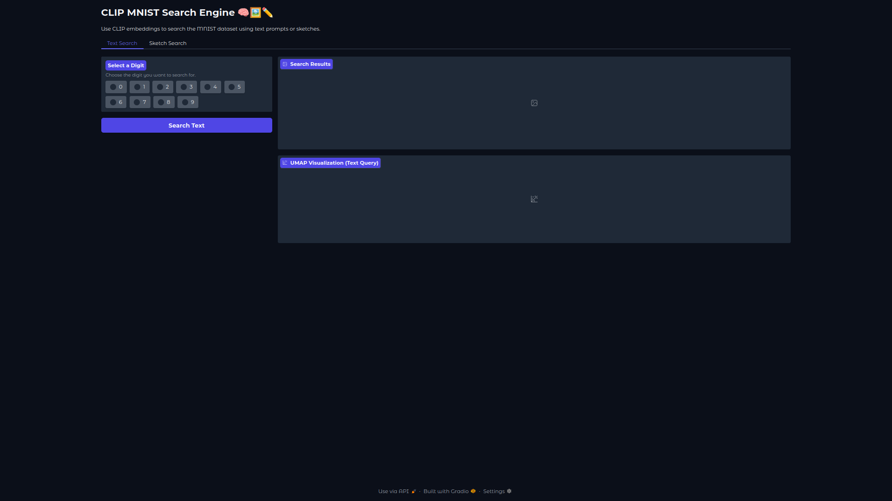
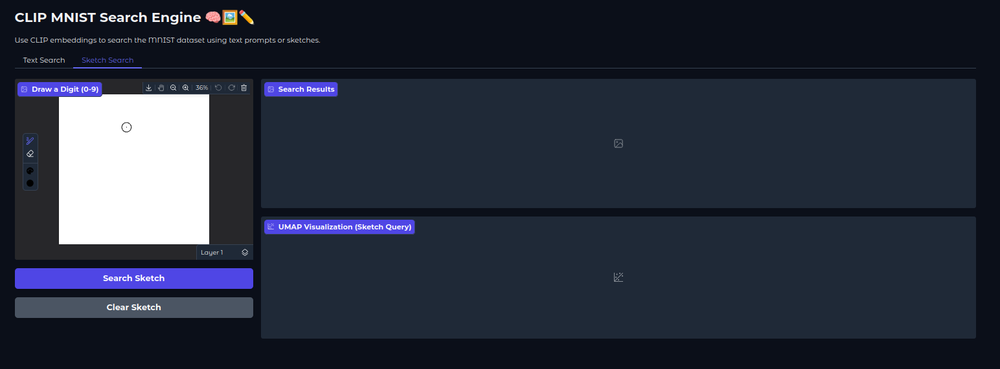
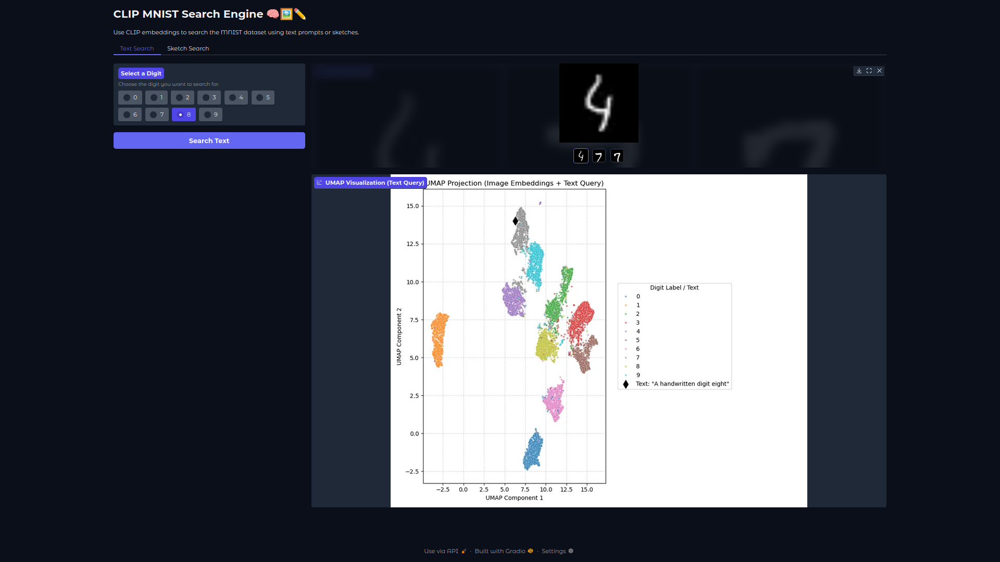
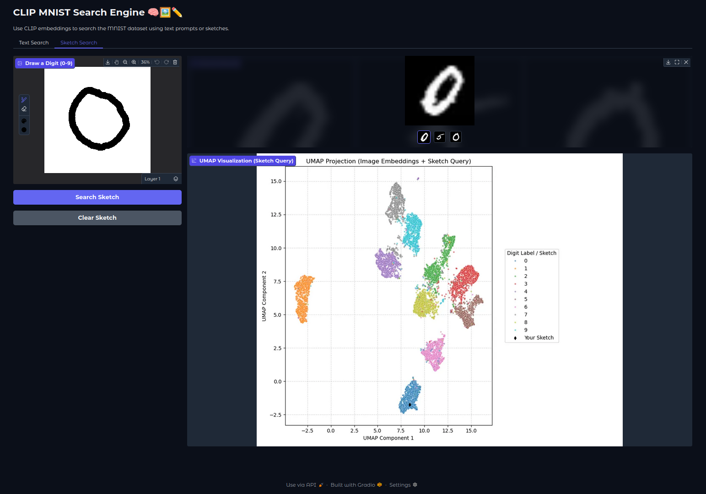
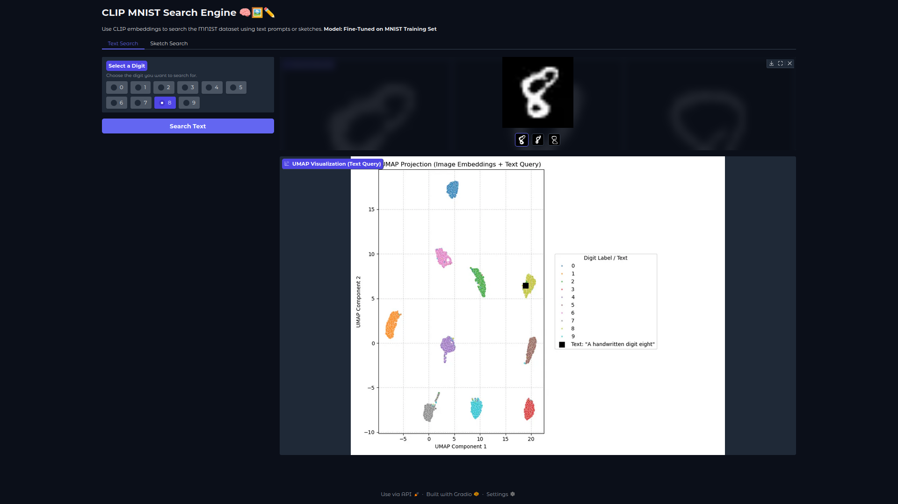

# 🔥 Fine-Tuning CLIP for MNIST: A Text & Sketch Search App 📱️

This repository contains a Jupyter Notebook that walks through the entire process of **fine-tuning** OpenAI's CLIP model to understand handwritten digits.

This project starts by demonstrating how pre-trained CLIP **fails** on a simple task like MNIST due to **domain mismatch**. It then implements a full fine-tuning pipeline to solve this problem.

The final result is a clean, **interactive Gradio app** for text-to-image and sketch-to-image search that works accurately on the newly-trained model.

# CLIP

[[Official Blog]](https://openai.com/blog/clip/) [[Official Paper]](https://arxiv.org/abs/2103.00020) [[My Fine-Tuning Journey Blog]](YOUR_BLOG_POST_LINK_HERE) [[Project Notebook for fine-tuning]](clip_mnist_retrieval_demo.ipynb)

CLIP (Contrastive Language-Image Pre-Training) is a neural network trained on a variety of (image, text) pairs. It can be instructed in natural language to predict the most relevant text snippet, given an image, without directly optimizing for the task, similarly to the zero-shot capabilities of GPT-2 and 3. We found CLIP matches the performance of the original ResNet50 on ImageNet “zero-shot” without using any of the original 1.28M labeled examples, overcoming several major challenges in computer vision.
## Approach


## 🚀 Live Demo

You can try the final, fine-tuned app live on Hugging Face Spaces!

[](https://huggingface.co/spaces/anubhavdixit343/clip-mnist-search)

**[➡️ Click here to try the interactive demo!](https://huggingface.co/spaces/anubhavdixit343/clip-mnist-search)**




---

## 🎯 The Core Problem: Domain Mismatch

Pre-trained CLIP was trained on millions of **photo-text pairs** from the internet, but not on simple, 28x28 black-and-white bitmaps. Because of this "domain mismatch," its understanding of a text prompt like `"a handwritten digit eight"` is in a completely different part of the embedding space than its understanding of the *image* of a 8 from MNIST.

### Before Fine-Tuning

The pre-trained model consistently failed. The **UMAP plot** below shows that the text prompt for **"a handwritten digit eight"** (the black diamond) lands much closer to the **cluster of "7" images** than the actual "8" cluster. This is why searching for "8" returned images of "4" and "7". The similar can be seen for hte sketch of "zero".




### After Fine-Tuning 🔥

After fine-tuning the model on the MNIST training set, the model **"learns" the new domain**. The text and image embeddings are now correctly aligned. The same text prompt for **"a handwritten digit eight"** now lands perfectly inside the **"8" image cluster**. The similar is observed for the sketch of "zero".




---

## ✨ Key Features

* 🔬 **Analysis:** Visually demonstrates the "domain mismatch" problem using **UMAP**.
* 🔥 **Stable Fine-Tuning:** A complete PyTorch training loop to fine-tune CLIP on the 60,000-image MNIST training set.
* 🎨 **Interactive App:** A **Gradio** app with two modes:
    * **✍️ Text Search:** Find digits by typing "one", "two", "three", etc.
    * **✏️ Sketch Search:** Draw a digit and find the closest matches in the test set.

---

## 🚀 How to Run

This project is a single Jupyter Notebook. The easiest way to run it is to follow the cells in order.

### Setup

First, clone this repository and set up the Python environment.

```bash
# 1. Create a new Conda environment with Python 3.9
conda create -n clip_env python=3.9

# 2. Activate the new environment
conda activate clip_env

# 3. Clone (download) the repository from GitHub
git clone https://github.com/anubhavd22/clip-finetuning-mnist-retrieval.git

# 4. Navigate into the newly downloaded project folder
cd clip-finetuning-mnist-retrieval

# 5. Install Git LFS to handle the large model file
# (This may require a separate install: `conda install -c conda-forge git-lfs`)
git lfs install
git lfs pull

# 6. Install all the required Python libraries
# (This uses the "shopping list" in requirements.txt)
pip install -r requirements.txt
```

---

## 📚 References & Links

* **[Project Notebook](clip_mnist_retrieval_demo.ipynb)**: The full Jupyter Notebook for this project, right here in this repo.
* **[My Fine-Tuning Journey](YOUR_BLOG_POST_LINK_HERE)**: A detailed blog post on this experiment. (Link to be added)
* **[Official CLIP Paper](https://arxiv.org/abs/2103.00020)**: The foundational 2021 research paper from OpenAI.
* **[Official CLIP Blog](https://openai.com/blog/clip/)**: The original blog post introducing the model.
* **[Hugging Face Spaces](https://huggingface.co/spaces)**: The platform used to host the live, interactive demo.
* **[Gradio](https://www.gradio.app/)**: The Python library used to build the web app's UI.

