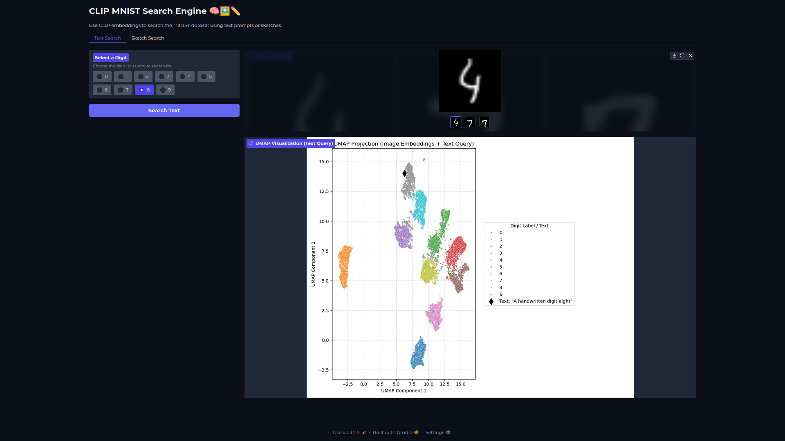
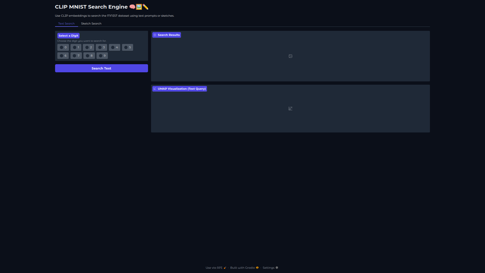
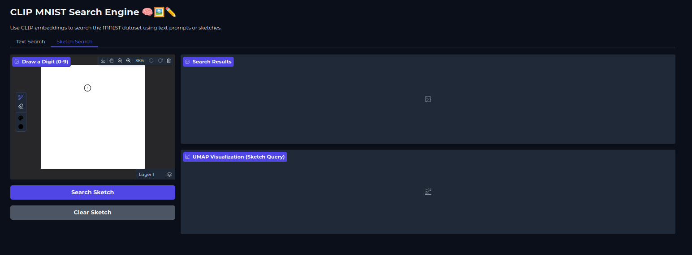

# 🧠🔥 Fine-Tuning CLIP for MNIST: A Text & Sketch Search App

This repository contains a Jupyter Notebook that walks through the entire process of **fine-tuning** OpenAI's CLIP model to understand handwritten digits.

This project starts by demonstrating how pre-trained CLIP **fails** on a simple task like MNIST due to **domain mismatch**. It then implements a full fine-tuning pipeline to solve this problem, including debugging `nan` (Not a Number) training errors.

The final result is a clean, **interactive Gradio app** for text-to-image and sketch-to-image search that works accurately on the newly-trained model.

## 🚀 Live Demo

You can try the final, fine-tuned app live on Hugging Face Spaces!

[](YOUR_HF_SPACE_LINK_HERE)

**[➡️ Click here to try the interactive demo!](YOUR_HF_SPACE_LINK_HERE)**

*(This README shows screenshots of the app before and after fine-tuning)*

| Before Fine-Tuning (Search for "8") | After Fine-Tuning (Search for "8") |
| :---: | :---: |
|  |  |
| **Failure:** The model is confused by the domain mismatch. | **Success:** The model correctly retrieves images of '8'. |

---

## 🎯 The Core Problem: Domain Mismatch

Pre-trained CLIP was trained on millions of **photo-text pairs** from the internet, but not on simple, 28x28 black-and-white bitmaps. Because of this "domain mismatch," its understanding of a text prompt like `"a handwritten digit four"` is in a completely different part of the embedding space than its understanding of the *image* of a 4 from MNIST.

### Before Fine-Tuning

The pre-trained model consistently failed. The **UMAP plot** below shows that the text prompt for **"a handwritten digit four"** (the black diamond) lands much closer to the **cluster of "7" images** (grey dots) than the actual "4" cluster (green dots). This is why searching for "4" returned images of "7".



### After Fine-Tuning

After fine-tuning the model on the MNIST training set, the model **"learns" the new domain**. The text and image embeddings are now correctly aligned. The same text prompt for **"a handwritten digit four"** now lands perfectly inside the **"4" image cluster**.



---

## ✨ Key Features

* 🔬 **Analysis:** Visually demonstrates the "domain mismatch" problem using **UMAP**.
* 🔥 **Stable Fine-Tuning:** A complete PyTorch training loop to fine-tune CLIP on the 60,000-image MNIST training set.
* 🎨 **Interactive App:** A **Gradio** app with two modes:
    * **✍️ Text Search:** Find digits by typing "one", "two", "three", etc.
    * **✏️ Sketch Search:** Draw a digit and find the closest matches in the test set.

---

## 🚀 How to Run

This project is a single Jupyter Notebook. The easiest way to run it is to follow the cells in order.

### 1. Setup

First, clone this repository and set up the Python environment.

```bash
# 1. Create a new Conda environment with Python 3.9
# (The '-y' flag automatically says yes to the setup)
conda create -n clip_env python=3.9 -y

# 2. Activate the new environment
conda activate clip_env

# 3. Clone (download) the repository from GitHub
git clone https://github.com/anubhavd22/clip-finetuning-mnist-retrieval.git

# 4. Navigate into the newly downloaded project folder
cd clip-finetuning-mnist-retrieval

# 5. Install Git LFS to handle the large model file
# (This may require a separate install: `conda install -c conda-forge git-lfs`)
git lfs install
git lfs pull

# 6. Install all the required Python libraries
# (This uses the "shopping list" in requirements.txt)
pip install -r requirements.txt
